# Guia de Diagrames Entitat/Relació (E/R) en format Mermaid

Un diagrama Entitat/Relació (E/R) és una eina clau per dissenyar i modelar visualment l'estructura i les relacions de les dades d'una base de dades abans de la seva implementació. El document és una guia pràctica que explica tots els seus elements clau utilitzant exemples d'un videojoc de rol.

## Entitats

Una entitat representa un objecte del món real, ja sigui físic o conceptual, sobre el qual volem emmagatzemar informació. Pensa en elles com els "substantius" de la nostra base de dades.

> **Exemple:** Si volem dissenyar una base de dades per a un videojoc, una entitat fonamental seria Personatge.

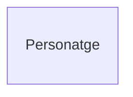

# Atributs
Els atributs són les propietats o característiques que descriuen una entitat. Són els "adjectius" que detallen cada instància d'una entitat.

Representació en Mermaid: es defineixen dins de les claus {} de la seva entitat.

## Tipus d'Atributs
Atribut Identificador (Clau Primària)
Els atributs defineixen les propietats de les entitats. En Mermaid es representen dins de l'entitat especificant el seu tipus de dada.

> Representació en Mermaid: s'afegeix la restricció PK (Primary Key) a l'atribut.

> Exemple: Un Personatge s'identifica unívocament pel seu codi.
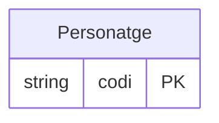

## Atributs Simples
Són atributs que no es poden dividir en parts més petites amb significat propi.

> Exemple: nom, nivell i vida són atributs simples de l'entitat Personatge.

> Repressentació en Mermaid: s'afegeix el nom de l'atribut precedit pel tipus de dada (string, int, bool, etc.).

 ```mermaid
erDiagram
    Personatge {
        string codi PK
        string nom
        int nivell
        int vida
    }
```

## Atributs no nuls
Son atributs que, per definició i disseny, mai poden estar sense valor

> Exemple: El nom d'una Mascota.

> Representació: Afegirem al final `"NOT NULL"`
>
> Realment podem afegir al final el comentari que volguem, pero adoptarem la convenció de fer servir tots `"NOT NULL"`
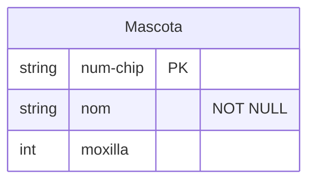

## Atributs Compostos
Són atributs que es poden descompondre en sub-atributs més petits i amb significat propi.

> Representació: Mermaid no té una sintaxi específica per a atributs compostos. La pràctica habitual és representar directament els seus components com a atributs simples.

> Exemple: Si volguéssim desglossar les dimensions o característiques físiques de l'entitat Item, faríem servir atributs directes com pes i mesures.
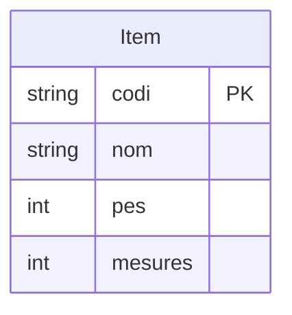

## Atributs Multivaluats
Són atributs que poden tenir múltiples valors per a una mateixa instància de l'entitat.

>Representació: Mermaid no suporta directament els atributs multivaluats. La solució correcta, que s'alinea amb la implementació final a la base de dades, és crear una nova entitat per a l'atribut i establir una relació de molts a molts o d'un a molts.

>Exemple: Un Personatge pot posseir moltes habilitats, i una Habilitat pot ser posseïda per molts personatges. Creem la relació corresponent entre ambdues entitats.

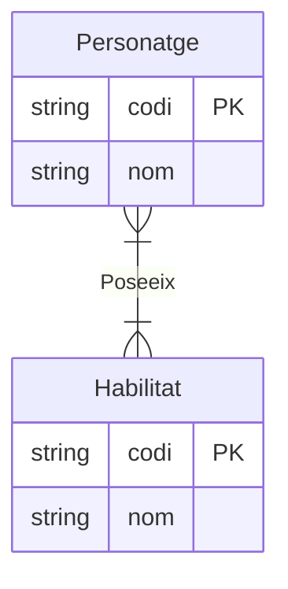

# Relacions
Una relació és una associació o vincle entre dues o més entitats. Representa les "accions" o "connexions" que existeixen entre els nostres "substantius".

> Representació: Es dibuixen com una línia que connecta les entitats, amb un verb descriptiu a l'etiqueta de la línia.

> Exemple: Un Personatge equipa un Item.

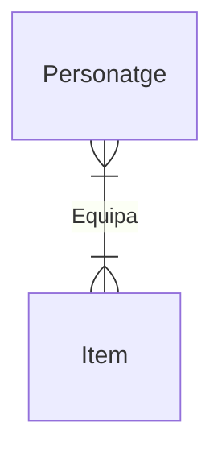
## Cardinalitat de la Relació
La cardinalitat indica el nombre d'instàncies d'una entitat que es poden relacionar amb una instància d'una altra entitat. Mermaid utilitza símbols a cada extrem de la línia per representar-la.
```
|o : Un o zero

|| : Exactament un

}o : Molts o zero

}| : Molts o un

o| : Zero o un
```

## Un a Un (1:1)
Una instància de l'Entitat A es relaciona amb, com a màxim, una instància de l'Entitat B, i viceversa.

Exemple: Un Personatge acompanya una única Mascota, i una Mascota acompanya un únic Personatge.
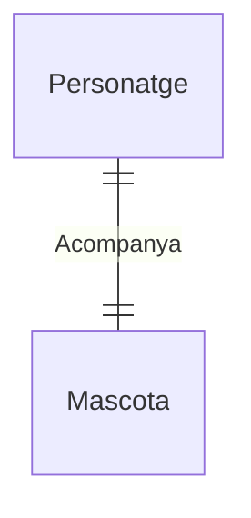

## Un a Molts (1:N)
Una instància de l'Entitat A es pot relacionar amb diverses instàncies de l'Entitat B, però una instància de B només es relaciona amb una d'A.

> Exemple: Modificant lleugerament el nostre sistema de joc, assumirem que un **Personatge** pot tenir al seu càrrec **moltes Mascotes** per a què l'ajudin, però cada **Mascota** està vinculada i fidelitzada a **un únic** personatge.


## Molts a Molts (M:N)
Una instància de l'Entitat A es pot relacionar amb diverses instàncies de l'Entitat B, i viceversa.

> Exemple: Un Personatge es pot enfrontar a molts Enemics, i un Enemic es pot enfrontar a molts Personatges.
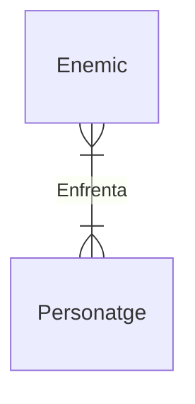

> [!IMPORTANT]
> Nota Important: Les relacions M:N no es poden implementar directament en una base de dades relacional. En passar al model relacional, es converteixen en una nova taula (anomenada taula intermèdia o d'unió).

Atributs a les Relacions

> De vegades, un atribut no descriu una entitat, sinó la relació entre elles. Això és molt comú en relacions M:N.

> Representació: La manera correcta de modelar-ho, també per a la futura implementació, és convertir la relació en una entitat associativa. Aquesta nova entitat conté l'atribut i es connecta a les dues entitats originals.

Exemple: En la relació on una Mascota carrega un Item, la quantitat de l'ítem que porta la mascota no és pròpia de l'ítem en si (globalment) ni de la mascota, sinó de l'acció de carregar-lo. El model es transformaria creant una entitat intermèdia:

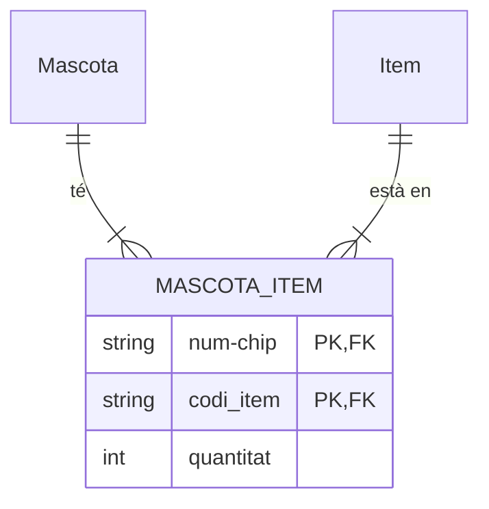

## Participació (Total vs. Parcial)
La participació indica si l'existència d'una instància d'una entitat depèn de la seva participació en una relació.

- Participació Total: Tota instància de l'entitat ha de participar en la relació (representat clàssicament amb una doble línia) (||).

- Participació Parcial: No és obligatori que totes les instàncies hi participin (línia simple) (}|).

> Exemple: En el nostre model, una Mascota requereix estar vinculada obligatòriament a un Personatge (||). Per tant, la participació de Mascota és total.


Entitats Febles

Una entitat feble és aquella que depèn d'una entitat forta (o propietària) per existir. No té prou atributs propis per identificar-se de manera única i necessita la clau de l'entitat forta.

> Representació: Com que Mermaid no té un disseny de doble rectangle específic per a entitats febles, es dibuixen com una entitat normal, indicant que la seva clau primària depèn de l'entitat forta.

> Exemple: Una Mascota que depèn d'un Personatge. Tot i que a la pràctica se li pot assignar una clau pròpia (com el num-chip), conceptualment la seva existència està totalment lligada al personatge.

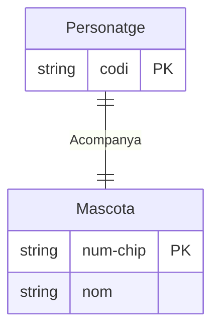

Relacions Reflexives (o Recursives)

Ocorren quan una entitat es relaciona amb si mateixa.

> Exemple: En el nostre videojoc, una Habilitat es pot combinar amb una altra Habilitat per crear un efecte nou o un combo.
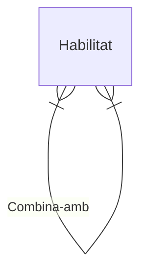

Generalització / Especialització (Herència)
Aquest concepte s'utilitza per a modelar jerarquies de "és un/a" (ISA, de l'anglès "is a"), similar a l'herència en programació orientada a objectes. Una entitat genèrica (superclasse) es pot especialitzar en sub-entitats més específiques (subclasses).

> Representació: el motor de Mermaid per a erDiagram no té una sintaxi específica i directa per representar la generalització/especialització (herència)

> Solució: Per representar aquest concepte correctament en un erDiagram, la millor pràctica és modelar la relació "és un/a" mitjançant una relació d'identificació u a u (||--||).

> Exemple: Al nostre joc, tant els Personatges (jugables) com els Enemics comparteixen gairebé tots els atributs (nom, cost, dany, nivell, vida, forca, agilitat, carisma). Podríem extreure un concepte paraigua anomenat Entitat_Viva o Combatent, de la qual heretarien ambdues entitats.
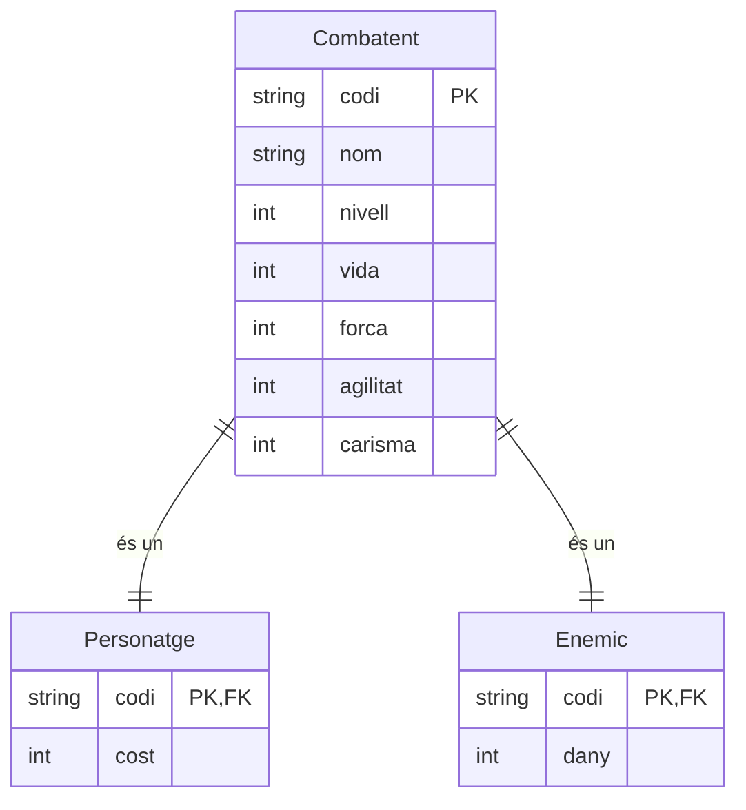
