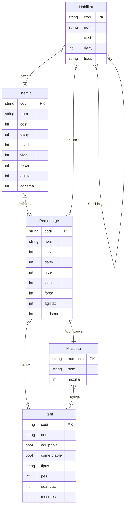

```mermaid
erDiagram
    Habilitat |{--|{ Enemic : Enfrenta
    Habilitat |{--|{ Habilitat : Combina-amb
    Enemic |{--|{ Personatge : Enfrenta
    Personatge |{--|{ Habilitat : Poseeix
    Personatge |{--|{ Item : Equipa
    Personatge ||--|| Mascota : Acompanya
    Mascota |{--|{ Item : Carrega
    Habilitat {
        string  codi    PK
        string  nom
        int     cost
        int     dany
        string  tipus
    }
    Enemic {
        string codi     PK
        string  nom
        int     cost
        int     dany
        int     nivell
        int     vida
        int     forca
        int     agilitat
        int     carisma
    }
    Personatge {
        string codi     PK
        string  nom
        int     cost
        int     dany
        int     nivell
        int     vida
        int     forca
        int     agilitat
        int     carisma
    }
    Mascota {
        string num-chip PK
        string nom
        int moxilla
    }
    Item {
        string codi     PK
        string  nom
        bool    equipable
        bool    comerciable
        string  tipus
        int     pes
        int     quantitat
        int     mesures
    }
```
